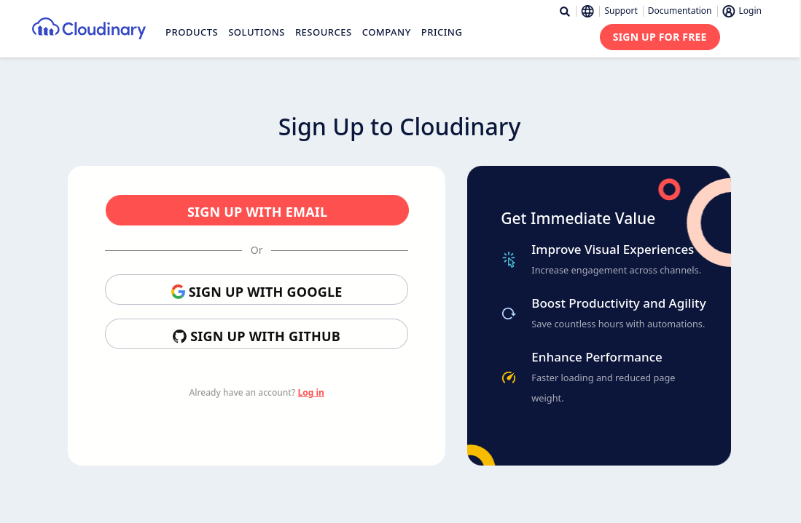

<h1 align="center">
    <br>
     
    <br>
    Groupomania, Inc. Chat
    <br>
</h1>

<h4 align="center">This project is an <a href="https://openclassrooms.com/">OpenClassrooms</a> assignment.</h4>

<p align="center">
    <a href="https://nodejs.dev">
        
    </a>
    <a href="https://nodejs.dev">
        
    </a>
    <a href="https://nodejs.dev">
        
    </a>
    <a href="https://nodejs.dev">
        
    </a>
</p>

<p align="center">
    <a href="#how-to-host">How to host</a> •
    <a href="#license">License</a> •
    <a href="#credits">Credits</a>
</p>

## How to host

### Setup .env

Create a new `.env` file an paste this in

```shell
# Prisma
DATABASE_URL=file:./db.sqlite

# Next Auth
NEXTAUTH_SECRET=roeGtAsjfrzOIxUJiOhC
NEXTAUTH_URL=http://localhost:3000

# Cloudinary
NEXT_PUBLIC_MAXIMUM_UPLOAD_SIZE=5000000
NEXT_PUBLIC_CLOUDINARY_URL=
NEXT_PUBLIC_CLOUDINARY_POST_PRESET=groupomania-post
NEXT_PUBLIC_CLOUDINARY_PROFILE_PICTURE_PRESET=groupomania-profile-picture
NEXT_PUBLIC_CLOUDINARY_DEFAULT_PROFILE_PICTURE=

```


|                      Key                       |                  Description                   |     Type      |                   Value                   |
|------------------------------------------------|------------------------------------------------|---------------|-------------------------------------------|
| DATABASE_URL                                   | The database location (relative to `./prisma`) | path          | `file:./db.sqlite`                        |
| NEXTAUTH_SECRET                                | The next auth secret token                     | string        | `roeGtAsjfrzOIxUJiOhC`                    |
| NEXTAUTH_URL                                   | The next auth url                              | url           | `http://localhost:3000`                   |
| NEXT_PUBLIC_MAXIMUM_UPLOAD_SIZE                | Maximum upload size in bytes                   | number > 1000 |  `5000000`                                |
| NEXT_PUBLIC_CLOUDINARY_URL                     |                                                | url           | See [Cloudinary Setup](#cloudinary-setup) |
| NEXT_PUBLIC_CLOUDINARY_POST_PRESET             |                                                | string        | `groupomania-post`                        |
| NEXT_PUBLIC_CLOUDINARY_PROFILE_PICTURE_PRESET  |                                                | string        | `groupomania-profile-picture`             |
| NEXT_PUBLIC_CLOUDINARY_DEFAULT_PROFILE_PICTURE |                                                | url           | See [Cloudinary Setup](#cloudinary-setup) |


See [Cloudinary Setup](#cloudinary-setup) 

### Cloudinary setup

1. Create an account on [cloudinary.com](https://cloudinary.com/users/register_free)  


2. Go to Settings > Upload, and scroll down to [Add Upload Preset](https://cloudinary.com/console/lui/upload_presets/new)  


3. Enter the preset name (we'll create two presets: `groupomania-post` and `groupomania-profile-picture`). And set the signing mode to `Unsigned`  


4. Then, you can add some transformations by clicking on the `Edit` button. For example, you can set the maximum size of a profile picture to `256x256` etc  


5. I recommend you to set the format to `webp` for performance reasons. Once you've done, click `Save` and voilà!  


6. Create the other preset

### Cloning the repo and installing dependencies

```console
# clone repo
$ git clone https://github.com/groupomania-inc/app.git

# then install dependencies
$ cd app
$ npm ci
```

### Prisma setup

```console
$ npx prisma db push
```

### Then build/start

The first time you start the app, you'll have to create an administrator account.  

```
# build
$ npm run build

# build then start
$ npm run start

# start in dev mode
$ npm run dev
```

If you want to add a new administrator account, you can run `node setup.mjs --force` and follow the instructions.

<br>

## License

This project is <a href="https://opensource.org/licenses/MIT">MIT</a> licensed.

<br>

## Credits

- README design: <a href="https://github.com/amitmerchant1990/electron-markdownify/blob/master/README.md">github.com/amitmerchant1990</a>